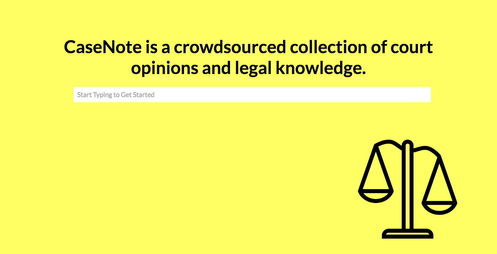
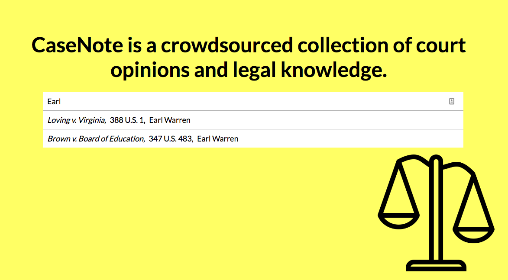
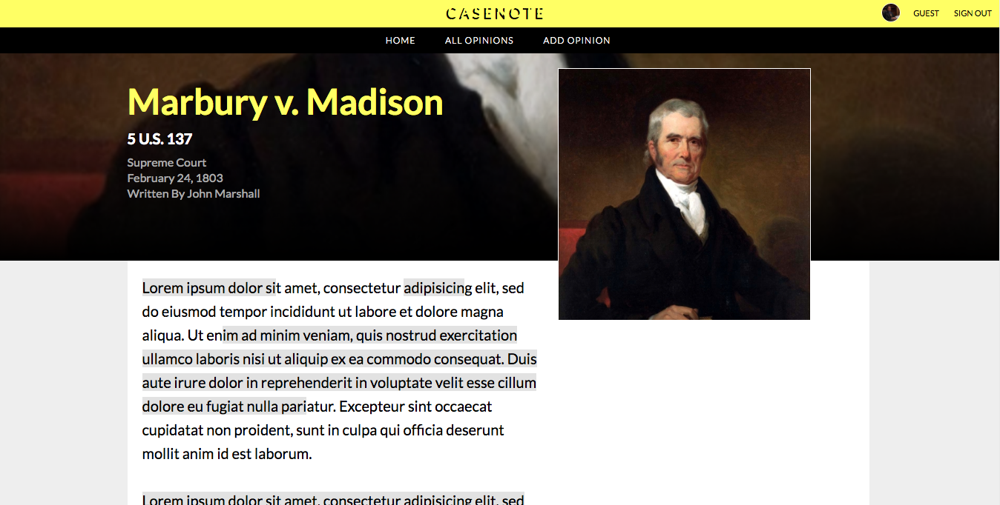
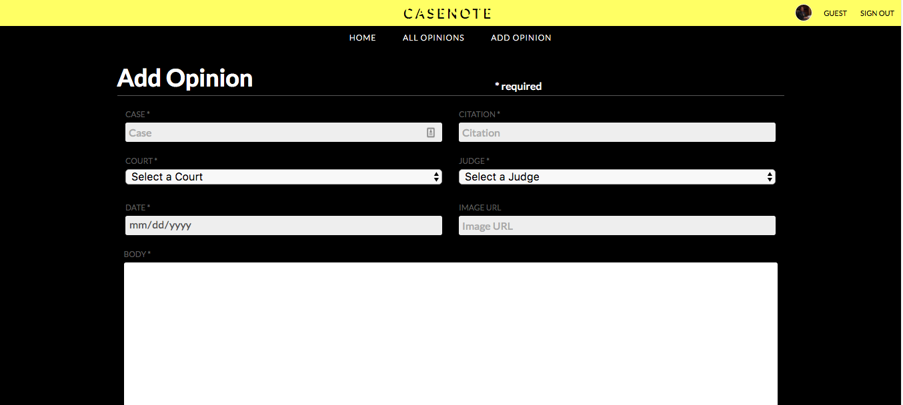
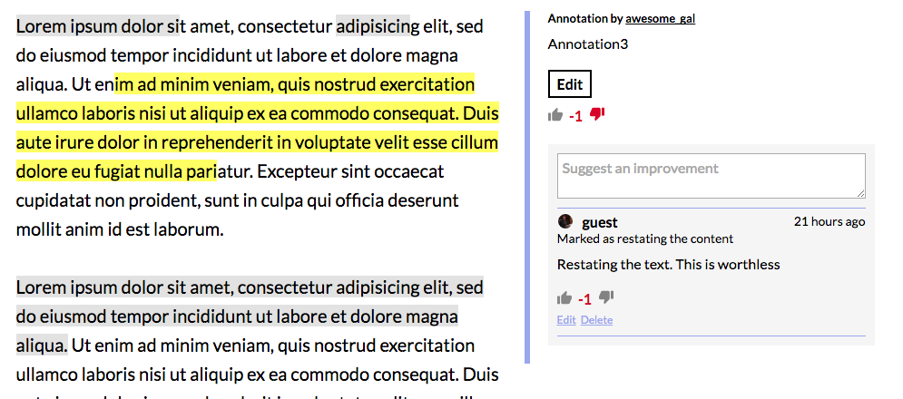
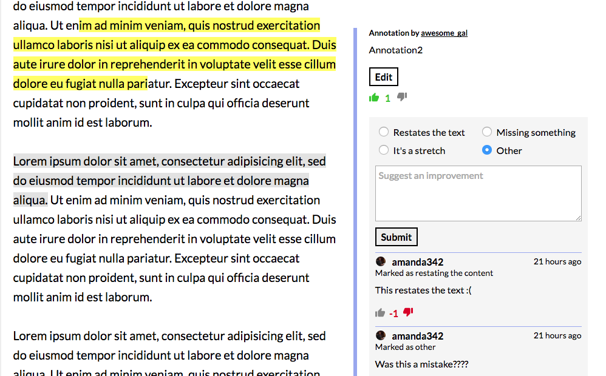
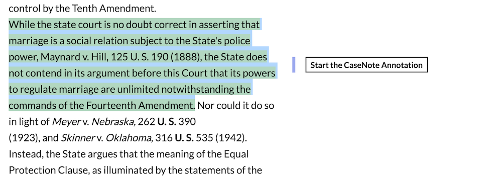
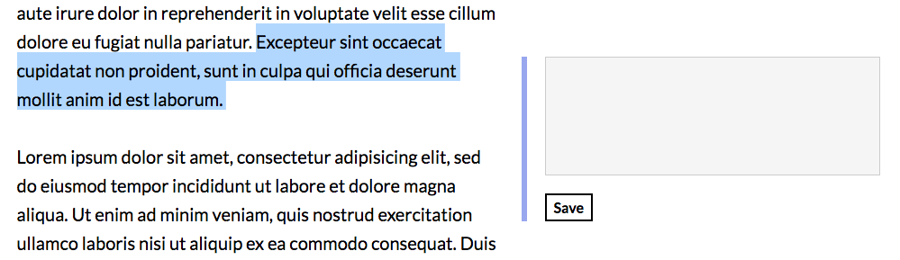

# CaseNote

[CaseNote Live][live]

[live]: https://casenote.herokuapp.com/#/

CaseNote is a full-stack web application inspired by Genius.  It utilizes Ruby on Rails on the backend, a PostgreSQL database, and React.js with a Redux architectural framework on the frontend.

## Features & Implementation

### Opinions

On the database side, court opinions are stored in one table which contains columss for `id`, `case`, `citation`, `date`, `body`, `transcriber_id`, `judge_id`, `court_id`, and `image`.  User have access to read all Opinions on the site, but can only comment, annotate, or edit opinions upon log in.  

**Viewing opinions**

Users can access opinions through either search or the opinions index in the navigation bar.  The search bar allows users to search by case name, citation, or judge name.

The opinion page shows the User the key information related to the opinion as well as a related image to the opinion.

**Creating opinions**

Users can create opinions by clicking the "Add Opinion" link in the navigation bar.  Opinions require a case name, citation, judge, court, and date.  The judge and court fields are drop down menus populated from judge and court reference tables.  Optionally, the user can add an image when creating the opinion.  By default, the image will be an image of the selected judge.  CaseNote utilizes Amazon Web Services to store these images.

### Annotations

**Viewing annotations**

In the text body of the opinions, annotations are distinguished by a gray background.  Users click on the annotation to view the details of that annotation in the right panel.

The user can vote on the annotation and make suggestions to refine the annotation. Users can also vote on suggestions.

**Creating annotations**

Users can create annotations by selecting the text in the opinion that they would like to annotate.  The right panel will display a button which allows users to start an annotation.

## Future Directions for the Project

In addition to the features already implemented, I plan to continue work on this project.  The next steps for CaseNote are outlined below.

### User Profiles and Rating

User Profiles tracks is a standard feature of Genius. This allows users to upload profile pictures, view feeds of their activity, and be rated based on their contributes to the site.

### Court Transcripts with Audio / Video

Although this is less essential functionality, I want to allow users to upload court transcripts and optionally include playable audio and/or video,
